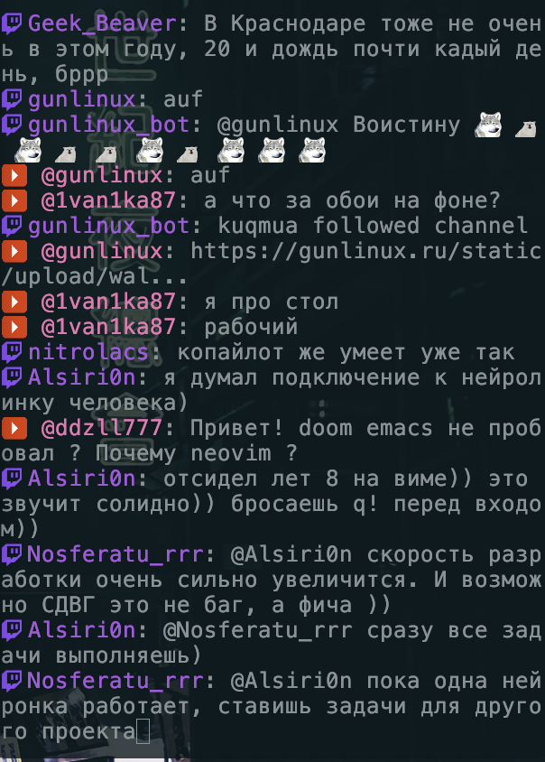

# termchat

An async, read-only terminal multi-chat aggregator. termchat reads live chat from multiple streaming platforms at once and displays them together in your terminal.



## Features

- **Multi-platform** — read Twitch and YouTube live chat simultaneously, with an architecture built for adding more providers.
- **Emotes inline** — Twitch (native, BTTV, 7TV) and YouTube custom emotes render as actual images in image-capable terminals (Kitty, iTerm2, WezTerm), with a `:shortcut:` fallback everywhere else.
- **Read-only** — no credentials required to follow public channels.
- **Two UIs** — a plain stdout stream (default) or a Textual TUI (`--tui`).
- **Resilient** — Twitch reconnects with backoff; YouTube waits and retries when a stream isn't live yet.

## Requirements

- Python 3.12+
- [uv](https://docs.astral.sh/uv/)

## Install

```bash
git clone https://github.com/gunlinux/termchat.git
cd termchat
uv sync
```

## Usage

```bash
# Twitch
uv run python -m termchat --twitch <channel>

# YouTube (channel handle; resolves to the active live stream)
uv run python -m termchat --youtube <channel>

# Both at once
uv run python -m termchat --twitch <channel> --youtube <channel>

# Textual TUI instead of plain stdout
uv run python -m termchat --twitch <channel> --tui

# No credentials? Try the demo pipeline
uv run python -m termchat --demo
```

At least one of `--twitch`, `--youtube`, or `--demo` is required (or supply channels via config).

> Inline emote images render only in the default stdout UI. TUI mode falls back to `:shortcut:` text.

## Configuration

CLI flags override config. Optional config file at `~/.config/termchat/config.toml`:

```toml
[twitch]
channel = "somechannel"

[youtube]
channel = "somechannel"
```

`TWITCH_OAUTH` may be set in the environment to read with credentials; anonymous read works without it.

## Development

```bash
uv run pytest      # tests
make check         # lint + fix + types + test
```

Development is test-driven and the codebase follows a clean, layered architecture (`domain` / `providers` / `infra` / `ui`).
